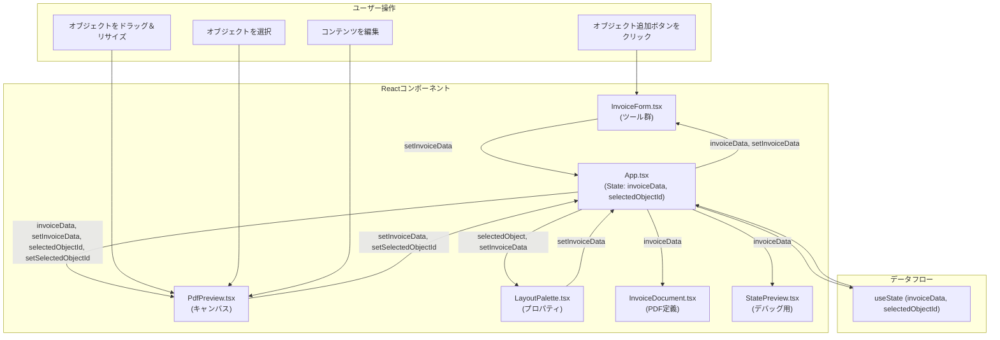

# 設計書 - 請求書エディタ

## 1. 概要

本ドキュメントは、インタラクティブな請求書エディタアプリケーションの設計について記述するものです。

### 1.1. プロジェクトの目的

ユーザーが直感的なUIを通じて、テキスト、画像、テーブルなどの要素を自由に配置・編集し、カスタマイズされた請求書を作成できるWebアプリケーションを提供します。

### 1.2. 主なゴール

- **WYSIWYG編集:** ユーザーが見たままの形で請求書を編集できる、インタラクティブなキャンバスを提供する。
- **柔軟なレイアウト:** テキスト、画像、テーブルなどのオブジェクトを、キャンバス上の任意の位置に配置し、サイズを変更できる。
- **PDF出力:** 作成した請求書を、高品質なPDFとしてダウンロードまたはプレビューできる。
- **拡張性:** 将来的に新しいオブジェクト（例：図形、署名欄）を追加しやすい、堅牢なデータ構造とコンポーネント設計を実現する。

## 2. アーキテクチャ

本アプリケーションは、クライアントサイドで完結するシングルページアプリケーション（SPA）として構築されます。



- **フレームワーク:** [React](https://reactjs.org/) (v18) を使用し、UIの構築と状態管理を行います。
- **ビルドツール:** [Vite](https://vitejs.dev/) を採用し、高速な開発サーバーと最適化されたビルドを実現します。
- **言語:** [TypeScript](https://www.typescriptlang.org/) を全面的に採用し、型安全性を確保します。
- **スタイリング:** [Tailwind CSS](https://tailwindcss.com/) を使用し、ユーティリティファーストのアプローチで効率的にUIを構築します。
- **パッケージ管理:** [pnpm](https://pnpm.io/) を使用し、高速で効率的な依存関係管理を行います。

## 3. コンポーネント設計

主要なReactコンポーネントとその責務は以下の通りです。

- **`App.tsx`**
  - アプリケーションのルートコンポーネント。
  - 請求書データ (`invoiceData`) や選択中のオブジェクトID (`selectedObjectId`) など、アプリケーション全体の状態を `useState` で一元管理します。
  - 主要なコンポーネント（`InvoiceForm`, `PdfPreview`, `LayoutPalette`など）のレイアウトと配置を担当します。

- **`InvoiceForm.tsx`**
  - 新しいレイアウトオブジェクト（テキスト、画像、テーブル）をキャンバスに追加するためのツールボタンを提供します。
  - ユーザーのアクションに応じて、`App.tsx` から受け取った `setInvoiceData` を呼び出し、状態を更新します。

- **`PdfPreview.tsx`**
  - 請求書のライブプレビューを表示する中心的なコンポーネント。
  - `react-rnd` を利用して、キャンバス上のオブジェクトのドラッグ＆ドロップ、リサイズを可能にします。
  - オブジェクトの選択状態を管理し、`setSelectedObjectId` を通じて `App.tsx` の状態を更新します。
  - テキストやテーブルセルのインライン編集機能を提供します。
  - `pdf-lib` を使用して、プレビュー用のPDFを動的に生成します。

- **`LayoutPalette.tsx`**
  - オブジェクトが選択された際に表示されるプロパティ編集パネル。
  - 選択されたオブジェクトのプロパティ（座標、サイズ、内容など）を表示し、ユーザーがこれらの値を編集できるようにします。（※本ドキュメント作成時点では表示のみ）

- **`InvoiceDocument.tsx`**
  - `@react-pdf/renderer` を使用して、ダウンロード用のPDFドキュメントの構造を定義します。
  - `invoiceData` を受け取り、レイアウトオブジェクトをPDFの要素としてマッピングします。

- **`StatePreview.tsx`**
  - 開発およびデバッグ用のユーティリティコンポーネント。
  - 現在の `invoiceData` の状態をJSON形式でリアルタイムに表示します。

## 4. データモデル

データ構造の定義とバリデーションには `zod` を使用し、型安全とデータの一貫性を保証します。TypeScriptの型は、Zodスキーマから `z.infer` を使って自動的に生成されます。

- **`LayoutItem` (判別共用体)**
  - キャンバス上のすべてのオブジェクトを表すための中心的な型です。
  - `type` プロパティ（`'text'`, `'image'`, `'table'`）によって、オブジェクトの種類を判別します。
  - 各オブジェクトは、共通のプロパティ（`id`, `x`, `y`, `width`, `height`）を持ちます。
  - `type` ごとに固有のプロパティを持ちます（例：`TextItem` は `content`、`ImageItem` は `data`）。

- **`InvoiceData`**
  - アプリケーションのルートとなるデータ構造です。
  - `layout` プロパティを持ち、`LayoutItem` の配列としてすべてのオブジェクトを管理します。

```typescript
// client/src/schemas.ts の例

export const TextItemSchema = z.object({
  type: z.literal('text'),
  // ... other properties
});

export const LayoutItemSchema = z.discriminatedUnion("type", [
  TextItemSchema,
  ImageItemSchema,
  TableItemSchema,
]);

export const InvoiceDataSchema = z.object({
  layout: z.array(LayoutItemSchema),
});
```

## 5. 状態管理

アプリケーションの状態は、Reactの `useState` フックを用いて `App.tsx` コンポーネント内で集中的に管理されます。このシンプルなアプローチは、現在のアプリケーションの規模に適しています。

- **`invoiceData`**: `InvoiceData` 型のオブジェクトで、請求書のすべてのレイアウト情報を含みます。
- **`selectedObjectId`**: 現在ユーザーが選択しているオブジェクトの `id`（文字列）、または何も選択されていない場合は `null`。

状態の更新は、各コンポーネントが `App.tsx` から受け取った `setInvoiceData` や `setSelectedObjectId` などのセッター関数を呼び出すことで行われます。これにより、データフローが単一方向（トップダウン）に保たれ、予測可能な状態遷移が実現されます。

## 6. 主要機能の実装詳細

### 6.1. インタラクティブなキャンバス

- **オブジェクトの操作:** `react-rnd` ライブラリを各レイアウトオブジェクトのラッパーとして使用します。`onDragStop` と `onResizeStop` イベントをリッスンし、オブジェクトの `x`, `y`, `width`, `height` プロパティを更新します。
- **インライン編集:** テキストやテーブルセルは、通常は `<span>` や `<td>` で表示されます。ユーザーがこれらをダブルクリックすると、`editingText` や `editingCell` といったローカルステートが更新され、要素が `<input>` に切り替わります。`onBlur` イベントで編集モードを終了します。

### 6.2. PDF生成

本アプリケーションでは、目的別に2つのライブラリを使い分けてPDFを生成します。

- **ライブプレビュー (`PdfPreview.tsx`):**
  - `pdf-lib` を使用します。このライブラリは、既存のPDFを操作したり、低レベルのAPIでPDFを動的に構築するのに適しています。
  - `invoiceData` が変更されるたびに、`generatePdfBytes` 関数が呼び出され、オブジェクト（現在は画像のみ）を描画した新しいPDFのバイナリデータ (`Uint8Array`) を生成します。
  - 生成されたバイナリデータは `react-pdf` に渡され、Canvasとしてプレビュー表示されます。これにより、高速な再描画が可能になります。

- **ダウンロード (`InvoiceDocument.tsx`):**
  - `@react-pdf/renderer` を使用します。このライブラリは、Reactコンポーネントの宣言的な構文でPDFドキュメントを定義できるため、最終的な出力用のレイアウトを構築するのに適しています。
  - `InvoiceDocument` コンポーネントは、`invoiceData.layout` 配列をマップし、各レイアウトオブジェクトを対応するPDF要素（`<Text>`, `<Image>`, `<View>`など）に変換します。
