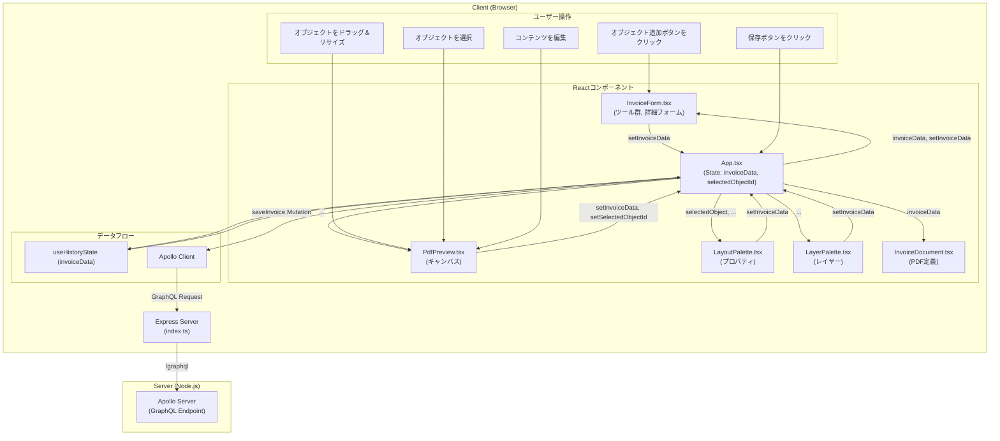

# 設計書 - 請求書エディタ

## 1. 概要

本ドキュメントは、インタラクティブな請求書エディタアプリケーションの設計について記述するものです。

### 1.1. プロジェクトの目的

ユーザーが直感的なUIを通じて、テキスト、画像、テーブルなどの要素を自由に配置・編集し、カスタマイズされた請求書を作成できるWebアプリケーションを提供します。

### 1.2. 主なゴール

- **WYSIWYG編集:** ユーザーが見たままの形で請求書を編集できる、インタラクティブなキャンバスを提供する。
- **柔軟なレイアウト:** テキスト、画像、テーブルなどのオブジェクトを、キャンバス上の任意の位置に配置し、サイズを変更できる。
- **PDF出力:** 作成した請求書を、高品質なPDFとしてダウンロードまたはプレビューできる。
- **拡張性:** 将来的に新しいオブジェクト（例：図形、署名欄）を追加しやすい、堅牢なデータ構造とコンポーネント設計を実現する。

## 2. アーキテクチャ

本アプリケーションは、ReactベースのクライアントとNode.js/Expressベースのサーバーで構成されるクライアントサーバーアーキテクチャを採用します。



- **クライアント:**
  - **フレームワーク:** [React](https://reactjs.org/) (v18) を使用し、UIの構築と状態管理を行います。
  - **GraphQLクライアント:** [Apollo Client](https://www.apollographql.com/docs/react/) を使用し、サーバーとのデータ通信を管理します。
  - **ビルドツール:** [Vite](https://vitejs.dev/) を採用し、高速な開発サーバーと最適化されたビルドを実現します。
  - **言語:** [TypeScript](https://www.typescriptlang.org/) を全面的に採用し、型安全性を確保します。
  - **スタイリング:** [Tailwind CSS](https://tailwindcss.com/) を使用し、ユーティリティファーストのアプローチで効率的にUIを構築します。

- **サーバー:**
  - **フレームワーク:** [Express](https://expressjs.com/) を使用し、堅牢なAPIサーバーを構築します。
  - **GraphQLサーバー:** [Apollo Server](https://www.apollographql.com/docs/apollo-server/) をExpressに統合し、GraphQL APIを提供します。

- **パッケージ管理:** [pnpm](https://pnpm.io/) を使用し、高速で効率的な依存関係管理を行います。

## 3. コンポーネント設計

主要なReactコンポーネントとその責務は以下の通りです。

- **`App.tsx`**
  - アプリケーションのルートコンポーネント。
  - 請求書データ (`invoiceData`) や選択中のオブジェクトID (`selectedObjectId`) など、アプリケーション全体の状態を `useHistoryState` カスタムフックで一元管理します。
  - 主要なコンポーネントのレイアウトと配置を担当し、状態とセッター関数を各コンポーネントにpropsとして渡します。

- **`InvoiceForm.tsx`**
  - 新しいレイアウトオブジェクト（テキスト、画像、テーブル）を追加するためのツールボタンを提供します。
  - PDFファイルを画像としてアップロードする機能を提供します。
  - 請求書の詳細情報（自社情報、宛先、請求書番号など）を入力するためのフォームを提供します。

- **`PdfPreview.tsx`**
  - 請求書のライブプレビューを表示する中心的なコンポーネント。
  - `react-rnd` を利用して、キャンバス上のオブジェクトのドラッグ＆ドロップ、リサイズを可能にします。
  - オブジェクトの選択状態と`zIndex`に基づいたスタッキング順序を管理します。

- **`LayoutPalette.tsx`**
  - オブジェクトが選択された際に表示されるプロパティ編集パネル。
  - 選択されたオブジェクトの共通プロパティ（座標、サイズ）と、オブジェクト種別ごとの固有プロパティを編集するUIを提供します。

- **`TextObjectPalette.tsx`**
  - テキストオブジェクトが選択された際の詳細なプロパティ編集パネル。
  - コンテンツの種類（固定文言、変数、ラベル付き変数）の選択機能を提供します。
  - フォントスタイル（フォント、サイズ、色、配置など）の編集機能を提供します。

- **`LayerPalette.tsx`**
  - キャンバス上の全オブジェクトをレイヤーとして一覧表示し、管理するためのパネル。
  - レイヤーのスタッキング順序（`zIndex`）を上下に移動させる機能を提供します。
  - レイヤー（オブジェクト）の削除機能を提供します。

- **`InvoiceDocument.tsx`**
  - `@react-pdf/renderer` を使用して、ダウンロード用のPDFドキュメントの構造を定義します。
  - `invoiceData` を受け取り、レイアウトオブジェクトを`zIndex`でソートしてからPDFの要素としてマッピングします。

- **`StatePreview.tsx`**
  - 開発およびデバッグ用のユーティリティコンポーネント。
  - 現在の `invoiceData` の状態をJSON形式でリアルタイムに表示します。

## 4. データモデル

データ構造の定義とバリデーションには `zod` を使用します。これにより、以下の利点が得られます。

- **ランタイムの型安全性:** APIレスポンスやフォーム入力など、外部からのデータを実行時に検証し、予期せぬエラーを防ぎます。
- **単一の情報源 (Single Source of Truth):** Zodスキーマを定義するだけで、TypeScriptの型を `z.infer` を使って自動生成できるため、型定義の二重管理を防ぎます。
- **ドキュメントとしての役割:** スキーマ自体が、期待されるデータ構造の明確なドキュメントとして機能します。

TypeScriptの型は、このZodスキーマから `z.infer` を使って自動的に生成されます。

- **`LayoutItem` (判別共用体)**
  - キャンバス上のすべてのオブジェクトを表すための中心的な型です。
  - `type` プロパティ（`'text'`, `'image'`, `'table'`）によって、オブジェクトの種類を判別します。
  - 各オブジェクトは、共通のプロパティ（`id`, `x`, `y`, `width`, `height`, `zIndex`）を持ちます。
  - `TextItem` はさらに `contentType` (`'fixed'`, `'variable'`, `'labeled-variable'`) と `label` を持ち、動的なコンテンツ表現を可能にします。

- **`InvoiceData`**
  - アプリケーションのルートとなるデータ構造です。
  - `layout` プロパティは、`LayoutItem` の配列としてすべてのオブジェクトを管理します。
  - `form` プロパティは、請求書自体のデータ（請求書番号、会社情報、宛先情報など）を保持するオブジェクトです。

```typescript
// client/src/schemas.ts の例

const BaseLayoutItemSchema = z.object({
  id: z.string(),
  x: z.number(),
  y: z.number(),
  width: z.number(),
  height: z.number(),
  zIndex: z.number(),
});

export const TextItemSchema = BaseLayoutItemSchema.extend({
  type: z.literal('text'),
  content: z.string(),
  contentType: z.enum(["fixed", "variable", "labeled-variable"]).default("fixed"),
  label: z.string().optional(),
  // ... style properties
});

export const LayoutItemSchema = z.discriminatedUnion("type", [
  TextItemSchema,
  ImageItemSchema,
  TableItemSchema,
]);

export const InvoiceDataSchema = z.object({
  layout: z.array(LayoutItemSchema),
  form: z.object({
    issue_date: z.string().optional(),
    invoice_number: z.string().optional(),
    // ... other form fields
  }),
});
```

### 4.1. オブジェクト生成時の注意 (Note on Object Creation)

新しいレイアウトオブジェクトを生成し、`invoiceData` の `layout` 配列に追加する際は、TypeScriptの型推論の問題を回避するため、オブジェクトを `LayoutItem` 型として明示的に型付けすることが推奨されます。これにより、特に判別共用体（discriminated union）を扱う際に、より堅牢でエラーの少ない状態更新が保証されます。

## 5. 状態管理

アプリケーションの状態は、Reactのカスタムフック `useHistoryState` を用いて `App.tsx` コンポーネント内で集中的に管理されます。これにより、Undo/Redo機能を持ちながら、状態管理のロジックをコンポーネントから分離しています。

- **`invoiceData`**: `InvoiceData` 型のオブジェクトで、請求書のすべてのレイアウト情報とフォームデータの両方を含みます。
- **`selectedObjectId`**: 現在ユーザーが選択しているオブジェクトの `id`（文字列）、または何も選択されていない場合は `null`。

状態の更新は、各コンポーネントが `App.tsx` から受け取った `setInvoiceData` や `setSelectedObjectId` などのセッター関数を呼び出すことで行われます。これにより、データフローが単一方向（トップダウン）に保たれ、予測可能な状態遷移が実現されます。

### 5.1. Undo/Redo (履歴)

Undo/Redo機能は、カスタムフック `useHistoryState` を使用して実装されます。このフックは、アプリケーションの状態履歴を管理するためのロジックをカプセル化します。

- **`useHistoryState` フック:**
    - 状態のシーケンスを格納するための配列 `history` を維持します。
    - `history` 配列内の現在の状態を指す `index` を保持します。
    - **`setState`:** 状態が更新されると、現在のインデックスに新しい状態を履歴に追加し、元に戻された「将来の」状態を破棄します。
    - **`undo`:** `index` をデクリメントして、履歴内の前の状態に移動します。
    - **`redo`:** `index` をインクリメントして、履歴内の次の状態に移動します。
    - 現在の `state`、`setState` 関数、`undo` と `redo` 関数、およびボタンを有効/無効にするためのブール値フラグ `canUndo` と `canRedo` を返します。
    - メモリ消費を防ぐため、履歴の数にはデフォルトで50件の上限が設定されています。この上限は設定可能です。（参考: Adobe Photoshopのデフォルトは50件です）

- **`App.tsx` での統合:**
    - メインの `invoiceData` 状態は `useHistoryState` フックによって管理されます。
    - `undo` と `redo` 関数およびフラグは、ボタンが配置されている `InvoiceForm` コンポーネントに渡されます。

## 6. 主要機能の実装詳細

### 6.1. インタラクティブなキャンバス

- **オブジェクトの操作:** `react-rnd` ライブラリを各レイアウトオブジェクトのラッパーとして使用します。`onDragStop` と `onResizeStop` イベントをリッスンし、オブジェクトの `x`, `y`, `width`, `height` プロパティを更新します。
- **スタッキング:** 各オブジェクトの `zIndex` プロパティを `react-rnd` の `style` に渡すことで、キャンバス上での重なり順を制御します。
- **インライン編集:** テキストやテーブルセルは、通常は `<span>` や `<td>` で表示されます。ユーザーがこれらをダブルクリックすると、`editingText` や `editingCell` といったローカルステートが更新され、要素が `<input>` に切り替わります。`onBlur` イベントで編集モードを終了します。

#### 6.1.1. レイヤー管理

- **`zIndex`の採番:** 新しいオブジェクトが追加される際、既存のオブジェクトが持つ最大の `zIndex` に1を加えた値が新しい `zIndex` として採番されます。
- **UI:** `LayerPalette` コンポーネントは、全オブジェクトを `zIndex` の降順でリスト表示します。
- **順序変更:** ユーザーが「▲」または「▼」ボタンをクリックすると、`moveLayer` 関数が呼び出されます。この関数は、対象のオブジェクトと、その `zIndex` 上で隣接するオブジェクトの `zIndex` 値を交換することで、スタッキング順序を変更します。

#### 6.1.2. テキストオブジェクトの操作

- **コンテンツ種別:** `TextObjectPalette` を通じて、テキストの `contentType` を以下の3種類から選択できます。
  - **`fixed` (固定文言):** 静的なテキストを表示します。
  - **`variable` (変数):** `{{variable_name}}` の形式で変数を埋め込みます。この変数は、`invoiceData.form` の値に置き換えられて表示されます。
  - **`labeled-variable` (ラベル付き変数):** `label` プロパティと変数を組み合わせて、「請求書番号: 12345」のように表示します。
- **表示モード:** `App.tsx` のトグルボタンにより、変数表示を「変数名 (`{{...}}`)」と「実際のデータ」で切り替えることができ、レイアウト調整とプレビューを容易にします。

#### 6.1.3. PDFアップロード

- **ファイル処理:** ユーザーがPDFを選択すると、`handlePdfUpload` 関数が `FileReader` を使ってファイルを `ArrayBuffer` として読み込みます。
- **ページ変換:** `react-pdf` からインポートされた `pdfjs` ライブラリを使い、PDFドキュメントをロードします。その後、各ページをループ処理します。
- **画像化:** 各ページについて、`page.render()` を使って非表示の `<canvas>` 要素にページ内容を描画します。描画後、`canvas.toDataURL('image/png')` を呼び出して、ページをPNG画像のデータURLに変換します。
- **レイアウト追加:** 生成された画像データURLを持つ新しい `ImageItem` オブジェクトが作成され、`invoiceData.layout` に追加されます。各ページは個別の画像オブジェクトとして扱われます。

### 6.2. Service Interface

クライアントとサーバー間の通信は、明確に定義されたインターフェースを介して行われます。

#### 6.2.1. フロントエンド APIクライアント

コンポーネントの関心を分離するため、サーバー通信の詳細はAPIサービスクライアントにカプセル化します。コンポーネントは、具体的な通信プロトコル（GraphQL）を意識することなく、このクライアントを利用します。

**インターフェース定義 (TypeScript):**
```typescript
// client/src/services/api.ts (仮)
import { InvoiceData } from "../types";

export interface IInvoiceApiService {
  saveInvoice(invoiceData: InvoiceData): Promise<boolean>;
}
```

**実装:**
- このインターフェースの実装は、Apollo Clientを利用して行われます。
- `saveInvoice` メソッドは、内部で `saveInvoice` GraphQLミューテーションを呼び出します。
- その際、クライアントの `InvoiceData` 型から、GraphQLの `InvoiceDataInput` 型へのデータ変換も担当します。

#### 6.2.2. バックエンド API (GraphQL)

バックエンドは、データ永続化のためのGraphQLミューテーションを公開します。

**スキーマ定義 (SDL):**
```graphql
# 請求書データ全体を表現する入力型
input InvoiceDataInput {
  layout: [LayoutItemInput!]!
  form: FormInput!
}

# フォームデータを表現する入力型
input FormInput {
  issue_date: String
  invoice_number: String
  # ... other form fields
}

# 各レイアウトオブジェクトを表現する入力型。
# GraphQLのInput Unionの制約のため、各タイプのプロパティを
# オプショナルなフィールドとして一つの型にまとめています。
input LayoutItemInput {
  id: ID!
  type: String! # 'text', 'image', 'table'
  x: Float!
  y: Float!
  width: Float!
  height: Float!
  zIndex: Int!

  # TextItem properties
  content: String
  contentType: String
  label: String
  fontFamily: String
  fontSize: Int
  color: String
  align: String

  # ImageItem properties
  src: String

  # TableItem properties
  data: [[String]]
  backgroundColor: String
}

type Mutation {
  # 請求書データを保存するミューテーション
  saveInvoice(invoiceData: InvoiceDataInput!): Boolean
}

type Query {
  # (将来的に) 請求書データを取得するためのクエリ
  getInvoice(id: ID!): String # 返り値は仮
}
```

#### 6.2.3. データ永続化フロー

1.  **ユーザー操作:** ユーザーがUI上で保存ボタンをクリックします。
2.  **コンポーネント:** `App.tsx` が、現在の `invoiceData` 状態を引数に `IInvoiceApiService` の `saveInvoice` メソッドを呼び出します。
3.  **APIクライアント:** `saveInvoice` メソッドが、`invoiceData` を `InvoiceDataInput` 型に変換し、Apollo Clientを用いて `saveInvoice` ミューテーションを実行します。
4.  **サーバー:** GraphQLリクエストを受け取り、データを処理（現在はコンソール出力）し、結果を返します。
5.  **UI更新:** APIクライアントは結果を `Promise<boolean>` として返し、コンポーネントはそれに応じてUI（例: 保存成功の通知）を更新します。

### 6.3. PDF生成

本アプリケーションでは、目的別に2つのライブラリを使い分けてPDFを生成します。

- **ライブプレビュー (`PdfPreview.tsx`):**
  - `pdf-lib` を使用します。このライブラリは、既存のPDFを操作したり、低レベルのAPIでPDFを動的に構築するのに適しています。
  - `invoiceData` が変更されるたびに、`generatePdfBytes` 関数が呼び出され、オブジェクト（現在は画像のみ）を描画した新しいPDFのバイナリデータ (`Uint8Array`) を生成します。
  - **フォントの最適化:** パフォーマンスを向上させるため、フォントは一度だけフェッチおよび埋め込みされ、`fontCache` (Map) にキャッシュされます。同じフォントが再度要求された場合は、キャッシュから返されます。
  - 生成されたバイナリデータは `react-pdf` に渡され、Canvasとしてプレビュー表示されます。これにより、高速な再描画が可能になります。

- **ダウンロード (`InvoiceDocument.tsx`):**
  - `@react-pdf/renderer` を使用します。このライブラリは、Reactコンポーネントの宣言的な構文でPDFドキュメントを定義できるため、最終的な出力用のレイアウトを構築するのに適しています。
  - `InvoiceDocument` コンポーネントは、`invoiceData.layout` 配列をマップし、各レイアウトオブジェクトを対応するPDF要素（`<Text>`, `<Image>`, `<View>`など）に変換します。
