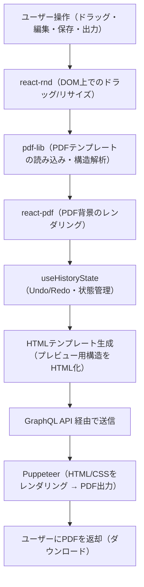

# アーキテクチャ概要

## システム全体のデータフロー



## コンポーネント詳細

### 1. ユーザー操作
- ドラッグ＆ドロップによるレイアウト配置
- テキスト・テーブル・画像の編集
- 保存・PDF出力などのアクション

### 2. react-rnd
**役割**: DOM上でのインタラクティブな操作を実現

- レイアウトアイテムのドラッグ＆リサイズ
- 座標(x, y)とサイズ(width, height)の取得
- リアルタイムなプレビュー更新

**主な使用箇所**:
- `client/src/components/DraggableResizableItem.tsx`

### 3. pdf-lib
**役割**: PDFテンプレートの読み込みと構造解析

- 既存PDFファイルの読み込み
- ページサイズの取得（A4: 595x842pt）
- メタデータの解析

**主な使用箇所**:
- `client/src/utils/pdf.ts`

### 4. react-pdf
**役割**: Canvas上にPDF背景をレンダリング

- PDFをCanvasとして表示
- エディタの背景として機能
- ページナビゲーション

**主な使用箇所**:
- `client/src/components/PdfPreview.tsx`
- `client/src/components/InvoiceDocument.tsx`

### 5. useHistoryState
**役割**: Undo/Redo機能と状態管理

- レイアウトの履歴管理
- Undo/Redoスタックの実装
- 状態の永続化

**主な使用箇所**:
- `client/src/hooks/useHistoryState.ts`

### 6. HTMLテンプレート生成
**役割**: エディタのレイアウトをHTML/CSSに変換

- Canvas座標系からPDF座標系への変換
  - Canvas: 595px × 842px (A4ポイント)
  - PDF: 210mm × 297mm (A4ミリメートル)
- スタイル情報の保持
- テーブル・画像・図形のHTML化

**主な使用箇所**:
- `client/src/utils/htmlGenerator.ts`
- `client/src/utils/coordinates.ts`

**変換ロジック**:
```typescript
export const pxToMm = (px: number): number => {
  return (px * 210) / 595;
};
```

### 7. GraphQL API
**役割**: クライアント・サーバー間の通信

**エンドポイント**: `http://localhost:4000/graphql`

**主なMutation**:
```graphql
mutation GeneratePdf($html: String!) {
  generatePdf(html: $html)
}
```

**主な使用箇所**:
- `client/src/graphql/invoiceQueries.ts`
- `server/src/index.ts`

### 8. Puppeteer
**役割**: HTML/CSSをブラウザでレンダリングしPDF出力

- Chromiumブラウザを起動
- HTMLコンテンツをレンダリング
- 高品質なPDFを生成（A4サイズ）
- 完全なWYSIWYG出力

**設定**:
```typescript
const browser = await puppeteer.launch({
  headless: true,
  args: ['--no-sandbox', '--disable-setuid-sandbox'],
});

const pdfBuffer = await page.pdf({
  width: "210mm",
  height: "297mm",
  printBackground: true,
  margin: { top: "0", right: "0", bottom: "0", left: "0" },
});
```

**主な使用箇所**:
- `server/src/index.ts` (generatePdf resolver)

### 9. PDFダウンロード
**役割**: 生成されたPDFをユーザーに返却

- base64エンコードされたPDFを受信
- Blobに変換
- 新しいタブで開く/ダウンロード

**主な使用箇所**:
- `client/src/hooks/usePdfGeneration.ts`

## アーキテクチャの特徴

### メリット

#### 1. リアルタイムプレビュー
- react-pdfでPDF背景を表示しながら編集
- 即座にレイアウトの変更を確認可能

#### 2. 柔軟なレイアウト編集
- react-rndによる直感的なドラッグ＆ドロップ
- ピクセル単位での精密な配置

#### 3. 完全なWYSIWYG
- Puppeteerで見たままをPDF化
- ブラウザのレンダリングエンジンを活用

#### 4. 履歴管理
- useHistoryStateでUndo/Redo実装
- 誤操作からの復帰が容易

### デメリット

#### 1. 座標変換の複雑さ
- Canvas座標とPDF座標の変換が必要
- ズレが発生する可能性

#### 2. サーバー依存
- PDF生成にサーバーサイドレンダリングが必須
- Puppeteerのブラウザ起動オーバーヘッド

#### 3. 既存PDF編集の制約
- PDF → HTML変換は困難
- 新規作成中心のワークフロー

## 技術スタック

### クライアント
- **React** + **TypeScript**: UI構築
- **react-rnd**: ドラッグ＆リサイズ
- **react-pdf**: PDFレンダリング
- **pdf-lib**: PDF解析
- **Apollo Client**: GraphQL通信
- **Material-UI**: UIコンポーネント

### サーバー
- **Node.js** + **TypeScript**: サーバー実装
- **Express**: Webフレームワーク
- **Apollo Server**: GraphQL API
- **Puppeteer**: PDF生成エンジン

## ディレクトリ構成

```
invoice-editor/
├── client/                    # フロントエンド
│   ├── src/
│   │   ├── components/        # Reactコンポーネント
│   │   ├── hooks/             # カスタムフック
│   │   ├── utils/             # ユーティリティ関数
│   │   │   ├── htmlGenerator.ts    # HTML生成
│   │   │   ├── coordinates.ts      # 座標変換
│   │   │   ├── pdf.ts              # PDF処理
│   │   │   └── apollo.ts           # GraphQL設定
│   │   └── graphql/           # GraphQLクエリ
│   └── package.json
│
├── server/                    # バックエンド
│   ├── src/
│   │   └── index.ts           # GraphQLサーバー
│   └── package.json
│
└── docs/                      # ドキュメント
    ├── ARCHITECTURE.md        # 本ファイル
    ├── DESIGN_DOC.md          # 設計ドキュメント
    └── adr/                   # アーキテクチャ決定記録
        ├── adr-pdf-library-selection.md
        └── adr-pdf-rendering-engine-selection.md
```

## 座標系の変換

### Canvas座標系（エディタ画面）
- **サイズ**: 595px × 842px
- **単位**: ピクセル (px)
- **用途**: react-rndでの配置

### PDF座標系（出力PDF）
- **サイズ**: 210mm × 297mm (A4)
- **単位**: ミリメートル (mm)
- **用途**: Playwright PDF生成

### 変換式
```typescript
// px → mm
mm = (px * 210) / 595

// mm → px
px = (mm * 595) / 210
```

## PDF生成フロー詳細

### 1. レイアウトデータの準備
```typescript
interface LayoutItem {
  id: string;
  type: 'text' | 'table' | 'image' | 'shape';
  x: number;      // Canvas座標 (px)
  y: number;      // Canvas座標 (px)
  width: number;  // Canvas座標 (px)
  height: number; // Canvas座標 (px)
  content: string;
  style: StyleInfo;
}
```

### 2. HTML生成
```typescript
const html = generateHtmlFromLayout(invoiceData, companyInfo);
// → 座標をmm単位に変換してHTML/CSSを生成
```

### 3. GraphQL送信
```typescript
const result = await generatePdfMutation({
  variables: { html: htmlContent }
});
```

### 4. サーバー側PDF生成
```typescript
const browser = await puppeteer.launch({ headless: true });
const page = await browser.newPage();
await page.setContent(html, { waitUntil: "networkidle0" });
const pdfBuffer = await page.pdf({ width: "210mm", height: "297mm" });
return Buffer.from(pdfBuffer).toString("base64");
```

### 5. クライアント側で受け取り
```typescript
const base64 = result.data.generatePdf;
const blob = new Blob([binaryData], { type: "application/pdf" });
const url = URL.createObjectURL(blob);
window.open(url);
```

## パフォーマンス考慮事項

### クライアント側
- **大きなPDFファイル**: react-pdfのレンダリングに時間がかかる
- **多数のレイアウトアイテム**: react-rndのドラッグが重くなる可能性

### サーバー側
- **Puppeteerブラウザ起動**: 初回起動に1-2秒かかる
- **複雑なHTML**: レンダリングに時間がかかる

## セキュリティ考慮事項

### CORS設定
```typescript
const corsOptions = {
  origin: ["http://localhost:5173", "http://localhost:5174"],
  optionsSuccessStatus: 200,
};
```

### サンドボックス
```typescript
args: ['--no-sandbox', '--disable-setuid-sandbox']
```

## 今後の拡張可能性

### 1. データベース統合
- 現在はモックデータ
- PostgreSQL/MongoDBなどでの永続化

### 2. 認証・認可
- ユーザー管理
- 請求書の共有・権限管理

### 3. テンプレート機能
- 複数のテンプレートから選択
- カスタムテンプレートの保存

### 4. バッチ処理
- 複数請求書の一括PDF生成
- PDFの一括ダウンロード

## 関連ドキュメント

- [設計ドキュメント](./DESIGN_DOC.md)
- [PDFライブラリ選定ADR](./adr/adr-pdf-library-selection.md)
- [PDFレンダリングエンジン選定ADR](./adr/adr-pdf-rendering-engine-selection.md)
