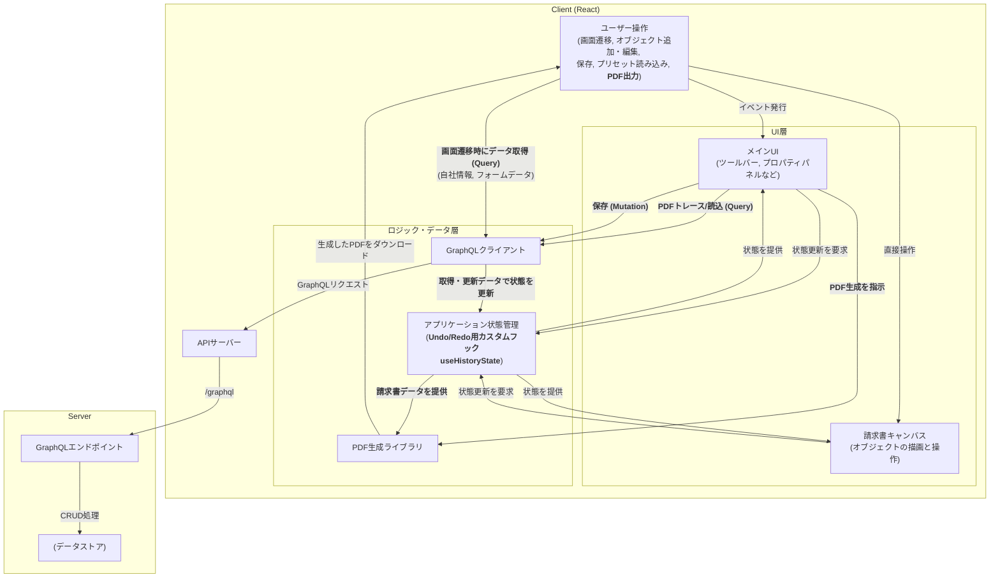

書類のカスタムレイアウト機能 - フロントエンド設計
Context and scopes
本ドキュメントは、請求書発行機能における 「書類のカスタムレイアウト」 を実現するためのフロントエンド設計を記述します。
ユーザーが GUI 上で請求書レイアウトを自由にカスタマイズできる機能を対象とします。
Goal
ユーザーが WYSIWYG 編集できるインタラクティブなキャンバスを提供する
Redo・Undo・コピーペーストなどの編集状態の管理を可能にする
各オブジェクト（テキスト・画像・テーブル等）に共通の操作（移動・リサイズ）を適用する
対象オブジェクトを プロパティパレットで詳細設定できるようにする
編集した請求書を PDF としてプレビューできること
Non Goals（Optional）
バックエンド側の詳細な設計は対象外
Architecture

概要
クライアントサイド: React + TypeScript
インタラクティブキャンバス + 設定 UI パネル
状態管理に useHistoryState を用いた Undo/Redo


サーバーサイド
GraphQL API を提供し、クライアントのデータ永続化を担当


この構成により、フロントは UI/操作に集中し、サーバーはデータ永続性を担保する役割分担を実現。

System context diagram

この機能は以下の間でのデータのやり取りを中心とします：
ユーザー（ブラウザ操作）
フロントエンド（React アプリ）
バックエンドサービス（GraphQL API）
データベース

アーキテクチャ図




Service Interface

```graphql
# 任意のJSONオブジェクトを表すカスタムスカラー型
scalar JSON

# 会社情報の各エントリの型
type CompanyInfoEntry {
  value: String # フィールドの値
  label: String # フィールドの表示ラベル
}

# フォームの各入力フィールドの型（文字列値）
input FormEntryInput {
  value: String # 入力フィールドの値
  label: String # 入力フィールドの表示ラベル
}

# フォームの各入力フィールドの型（数値値）
input FloatEntryInput {
  value: Float # 入力フィールドの数値
  label: String # 入力フィールドの表示ラベル
}

# 自社情報
# アプリケーション全体で利用されるデフォルトの会社情報。
# 各フィールドは値 (value) と表示ラベル (label) を持つ。
type CompanyInfo {
  name: CompanyInfoEntry # 会社名
  zip: CompanyInfoEntry # 郵便番号
  prefecture: CompanyInfoEntry # 都道府県
  city: CompanyInfoEntry # 市区町村
  street: CompanyInfoEntry # 番地
  building: CompanyInfoEntry # 建物名
  tel: CompanyInfoEntry # 電話番号
  fax: CompanyInfoEntry # FAX番号
  email: CompanyInfoEntry # メールアドレス
  contact_person: CompanyInfoEntry # 担当者名
  registration_number: CompanyInfoEntry # 適格請求書発行事業者登録番号
  payment_due_date: CompanyInfoEntry # 支払期限
  bank_account: CompanyInfoEntry # 振込先口座情報
}

# 請求書明細アイテムの型
type LineItem {
  name: CompanyInfoEntry # 品目名
  date: CompanyInfoEntry # 日付
  quantity: FloatEntry # 数量
  unit_price: FloatEntry # 単価
  amount: FloatEntry # 金額
}

# 請求書明細アイテムの入力型
input LineItemInput {
  name: FormEntryInput # 品目名
  date: FormEntryInput # 日付
  quantity: FloatEntryInput # 数量
  unit_price: FloatEntryInput # 単価
  amount: FloatEntryInput # 金額
}

# 請求書フォーム全体の型
type Form {
  issue_date: CompanyInfoEntry # 発行日
  due_date: CompanyInfoEntry # 支払期限
  invoice_number: CompanyInfoEntry # 請求書番号
  company_name: CompanyInfoEntry # 自社名
  company_zip: CompanyInfoEntry # 自社郵便番号
  company_prefecture: CompanyInfoEntry # 自社都道府県
  company_city: CompanyInfoEntry # 自社市区町村
  company_street: CompanyInfoEntry # 自社番地
  company_building: CompanyInfoEntry # 自社建物名
  company_tel: CompanyInfoEntry # 自社電話番号
  company_email: CompanyInfoEntry # 自社メールアドレス
  recipient_name: CompanyInfoEntry # 宛名
  recipient_title: CompanyInfoEntry # 宛先敬称
  recipient_zip: CompanyInfoEntry # 宛先郵便番号
  recipient_prefecture: CompanyInfoEntry # 宛先都道府県
  recipient_city: CompanyInfoEntry # 宛先市区町村
  recipient_street: CompanyInfoEntry # 宛先番地
  recipient_building: CompanyInfoEntry # 宛先建物名
  recipient_tel: CompanyInfoEntry # 宛先電話番号
  recipient_email: CompanyInfoEntry # 宛先メールアドレス
  subtotal: FloatEntry # 小計
  tax: FloatEntry # 消費税
  total: FloatEntry # 合計金額
  line_items: [LineItem!] # 明細アイテムのリスト
}

# 請求書全体のデータ型
type Invoice {
  id: ID!
  name: String!
  layout: JSON! # キャンバス上のオブジェクト配列
  form: JSON! # 請求日や顧客名などのフォームデータ
  createdAt: String!
  updatedAt: String!
}

# 新規作成用の入力データ型
input CreateInvoiceInput {
  name: String!
  layout: JSON!
  form: JSON!
}

# 更新用の入力データ型
input UpdateInvoiceInput {
  name: String
  layout: JSON
  form: JSON
}

# 取得系のクエリ
type Query {
  getInvoice(id: ID!): Invoice
  getInvoices: [Invoice!]! #PDFトレース用
  getCompanyInfo: CompanyInfo #自社情報取得。これは一般的なデフォルトの会社情報を提供します。
}

# 請求書データを変更するための操作
type Mutation {
  updateInvoice(id: ID!, input: UpdateInvoiceInput!): Invoice!
  createInvoice(input: CreateInvoiceInput!): Invoice! #当該画面では使用しない
  deleteInvoice(id: ID!): Boolean! #当該画面では使用しない
}
```


Technical Decisions
技術的な意思決定

- 主要技術スタック (Core Technology Stack)
  - フロントエンド: React と TypeScript を採用し、堅牢でコンポーネントベースのUIを構築します。
  - API通信: GraphQL を採用し、サーバーとの通信には Apollo Client を利用します。これにより、効率的なデータ取得と強力なキャッシュ機能、型安全なAPI操作を実現します。

- キャンバスの実装 (Canvas Implementation)
  - 採用技術: `react-rnd`, `pdf-lib`, react-pdf
  - 理由: キャンバスは複数の技術を組み合わせたハイブリッドな実装です。
    - インタラクティブな操作: react-rnd を使用し、各オブジェクトをドラッグ・リサイズ可能にしています。
    - 静的背景の描画: pdf-lib で画像などを含むPDFを動的に生成し、`react-pdf` でキャンバスの背景として描画。その上にインタラクティブなオブジェクトを重ねています。これによりWYSIWYGな編集体験とパフォーマンスを両立しています。

- PDF生成 (PDF Generation)
  - 採用技術: @react-pdf/renderer
  - 理由: 最終的なダウンロード用のPDFファイルは、` @react-pdf/renderer` を用いて生成します。`InvoiceDocument.tsx`がこの役割を担い、Reactコンポーネントから直接PDFを構築します。

- 状態管理 (State Management)
  - 採用技術: カスタムフック useHistoryState
  - 理由: 編集中のレイアウト情報など、Undo/Redoが必要なクライアント状態は`useHistoryState`フックで管理します。これにより、状態のスナップショットを配列として保持し、過去の状態へ簡単に移動できます。

Alternatives Considered（Optional）
検討した代替案とその理由

技術スタックや、アーキテクチャパターンを検討する際などに、検討した代替案があればご記入ください
Cross-cutting concerns（Optional）
システム全体に影響する非機能要件や共通処理があればご記入ください

非機能要件
対応ブラウザとか
ライブラリの保守性
アクセシビリティ
ツールバー操作はキーボード対応
ログ
パフォーマンス
いまこんなん