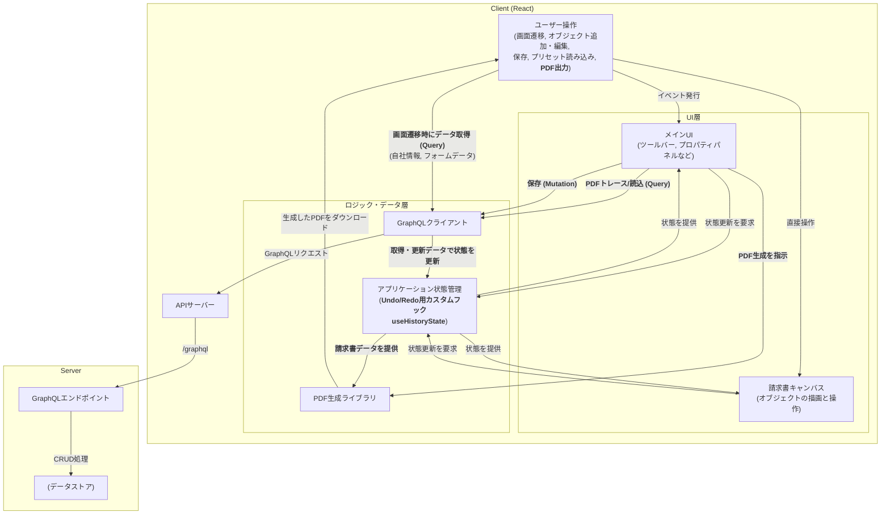

書類のカスタムレイアウト機能 - フロントエンド設計
Context and scopes
本ドキュメントは、請求書発行機能における 「書類のカスタムレイアウト」 を実現するためのフロントエンド設計を記述します。
ユーザーが GUI 上で請求書レイアウトを自由にカスタマイズできる機能を対象とします。
Goal
ユーザーが WYSIWYG 編集できるインタラクティブなキャンバスを提供する
Redo・Undo・コピーペーストなどの編集状態の管理を可能にする
各オブジェクト（テキスト・画像・テーブル等）に共通の操作（移動・リサイズ）を適用する
対象オブジェクトを プロパティパレットで詳細設定できるようにする
編集した請求書を PDF としてプレビューできること
Non Goals（Optional）
バックエンド側の詳細な設計は対象外
Architecture

概要
クライアントサイド: React + TypeScript
インタラクティブキャンバス + 設定 UI パネル
状態管理に useHistoryState を用いた Undo/Redo

サーバーサイド
GraphQL API を提供し、クライアントのデータ永続化を担当

この構成により、フロントは UI/操作に集中し、サーバーはデータ永続性を担保する役割分担を実現。

System context diagram

この機能は以下の間でのデータのやり取りを中心とします：
ユーザー（ブラウザ操作）
フロントエンド（React アプリ）
バックエンドサービス（GraphQL API）
データベース

アーキテクチャ図



Service Interface

```graphql
type BaseLayoutItem {
  id: ID!
  type: String! # text, image, table など
  x: Float!
  y: Float!
  width: Float!
  height: Float!
  rotation: Float
  properties: JSON
}

type Invoice {
  id: ID!
  name: String!
  layout: [BaseLayoutItem!]!
  form: JSON!
  createdAt: String!
  updatedAt: String!
}

input UpdateInvoiceInput {
  name: String
  layout: [JSON!] # BaseLayoutItem[] を JSON として受け取る
  form: JSON
}

type Query {
  getInvoice(id: ID!): Invoice
  getInvoices: [Invoice!]!
  getCompanyInfo: JSON
}

type Mutation {
  updateInvoice(id: ID!, input: UpdateInvoiceInput!): Invoice!
}

type Invoice {
  id: ID!
  name: String!
  layout: [BaseLayoutItem!]!
  form: JSON!
  createdAt: String!
  updatedAt: String!
}

input UpdateInvoiceInput {
  name: String
  layout: [JSON!] # BaseLayoutItem[] を JSON として受け取る
  form: JSON
}

type Query {
  getInvoice(id: ID!): Invoice
  getInvoices: [Invoice!]!
  getCompanyInfo: JSON
}

type Mutation {
  updateInvoice(id: ID!, input: UpdateInvoiceInput!): Invoice!
}
```

### Service Interface が扱う主要なオブジェクト型（TypeScript）

Service Interface は、クライアントサイドの状態管理（`AppState.invoiceData.objects`として）にも利用される以下の TypeScript 型に基づいて、PDF キャンバス上に配置されるインタラクティブなオブジェクトのデータ構造を扱います。特に、`Invoice`型の`layout`フィールドはこれらのオブジェクトの配列を JSON 形式で保持し、Service Interface を通じてバックエンドと交換されます。

````typescript
// PDF上のインタラクティブなオブジェクトの基底
export type BaseLayoutItem = {
  id: string; // オブジェクトの一意な識別子
  x: number; // PDF上でのX座標（左端からの距離）
  y: number; // PDF上でのY座標（上端からの距離）
  width: number; // オブジェクトの幅
  height: number; // オブジェクトの高さ
  zIndex: number; // オブジェクトの重なり順（大きいほど前面）
  locked?: boolean; // オブジェクトがロックされているか（編集不可）
  visible?: boolean; // オブジェクトが表示されているか
};

// テキストアイテムのスタイル定義
export type TextItemStyle = {
  fontFamily?: "Helvetica" | "BIZ UDPGothic"; // フォントファミリー
  fontSize?: number; // フォントサイズ
  lineHeight?: number; // 行の高さ
  textAlign?: "left" | "center" | "right"; // テキストの水平方向の配置
  verticalAlign?: "top" | "center" | "bottom"; // テキストの垂直方向の配置
  color?: string; // テキストの色
  bold?: boolean; // 太字かどうか
  italic?: boolean; // 斜体かどうか
  wordWrap?: boolean; // 自動改行するかどうか
  backgroundColor?: string; // 背景色
  textShadow?: string; // テキストの影
  isBullet?: boolean; // 箇条書きかどうか
};

// テキストオブジェクト
export type TextObject = BaseLayoutItem & {
  type: "text"; // オブジェクトのタイプ
  content: string; // 表示するテキスト内容
  contentType: "fixed" | "variable" | "labeled-variable"; // テキスト内容の種類
  label?: string; // 変数テキストの場合のラベル
  style?: TextItemStyle; // テキストのスタイル
};

// 画像オブジェクト
export type ImageObject = BaseLayoutItem & {
  type: "image"; // オブジェクトのタイプ
  src: string; // 画像のソース (URLまたはbase64データ)
};

// テーブルオブジェクト
export type TableObject = BaseLayoutItem & {
  type: "table";
  data: TableCell[][];
  style?: {
    backgroundColor?: string;
  };
};

// テーブルセル
export type TableCell = {
  id: string; // セルの一意な識別子
  content: string; // セルの内容
  contentType: "fixed" | "variable" | "labeled-variable"; // セル内容の種類
  label?: string; // 変数テキストの場合のラベル
  style?: TextItemStyle; // セルのテキストスタイル
};

書類のカスタムレイアウト機能 - フロントエンド設計
Context and scopes
本ドキュメントは、請求書発行機能における 「書類のカスタムレイアウト」 を実現するためのフロントエンド設計を記述します。
ユーザーが GUI 上で請求書レイアウトを自由にカスタマイズできる機能を対象とします。
Goal
ユーザーが WYSIWYG 編集できるインタラクティブなキャンバスを提供する
Redo・Undo・コピーペーストなどの編集状態の管理を可能にする
各オブジェクト（テキスト・画像・テーブル等）に共通の操作（移動・リサイズ）を適用する
対象オブジェクトを プロパティパレットで詳細設定できるようにする
編集した請求書を PDF としてプレビューできること
Non Goals（Optional）
バックエンド側の詳細な設計は対象外
Architecture

概要
クライアントサイド: React + TypeScript
インタラクティブキャンバス + 設定 UI パネル
状態管理に useHistoryState を用いた Undo/Redo

サーバーサイド
GraphQL API を提供し、クライアントのデータ永続化を担当

この構成により、フロントは UI/操作に集中し、サーバーはデータ永続性を担保する役割分担を実現。

System context diagram

この機能は以下の間でのデータのやり取りを中心とします：
ユーザー（ブラウザ操作）
フロントエンド（React アプリ）
バックエンドサービス（GraphQL API）
データベース

アーキテクチャ図

```mermaid
graph TD
    subgraph "Client (React)"
        User_Interactions["ユーザー操作<br/>(画面遷移, オブジェクト追加・編集, <br/>保存, プリセット読み込み, <b>PDF出力</b>)"]

        subgraph "UI層"
            Main_UI["メインUI<br/>(ツールバー, プロパティパネルなど)"]
            Canvas["請求書キャンバス<br/>(オブジェクトの描画と操作)"]
        end

        subgraph "ロジック・データ層"
            App_State["アプリケーション状態管理<br/>(<b>Undo/Redo用カスタムフック<br/>useHistoryState</b>)"]
            GraphQL_Client["GraphQLクライアント"]
            Pdf_Generator["PDF生成ライブラリ"]
        end

        User_Interactions -- "イベント発行" --> Main_UI
        User_Interactions -- "直接操作" --> Canvas

        Main_UI -- "状態更新を要求" --> App_State
        Canvas -- "状態更新を要求" --> App_State

        App_State -- "状態を提供" --> Main_UI
        App_State -- "状態を提供" --> Canvas

        %% PDF出力
        Main_UI -- "<b>PDF生成を指示</b>" --> Pdf_Generator
        App_State -- "<b>請求書データを提供</b>" --> Pdf_Generator
        Pdf_Generator -- "生成したPDFをダウンロード" --> User_Interactions

        %% データ永続化・復元
        User_Interactions -- "<b>画面遷移時にデータ取得 (Query)</b><br/>(自社情報, フォームデータ)" --> GraphQL_Client
        Main_UI -- "<b>PDFトレース/読込 (Query)</b>" --> GraphQL_Client
        Main_UI -- "<b>保存 (Mutation)</b>" --> GraphQL_Client
        GraphQL_Client -- "<b>取得・更新データで状態を更新</b>" --> App_State

        GraphQL_Client -- "GraphQLリクエスト" --> API_Server
    end

    subgraph "Server"
        API_Server["APIサーバー"]
        GraphQL_Endpoint["GraphQLエンドポイント"]
        Database["(データストア)"]

        API_Server -- "/graphql" --> GraphQL_Endpoint
        GraphQL_Endpoint -- "CRUD処理" --> Database
    end
````

Service Interface

```graphql
type BaseLayoutItem {
  id: ID!
  type: String! # text, image, table など
  x: Float!
  y: Float!
  width: Float!
  height: Float!
  rotation: Float
  properties: JSON
}

type Invoice {
  id: ID!
  name: String!
  layout: [BaseLayoutItem!]!
  form: JSON!
  createdAt: String!
  updatedAt: String!
}

input UpdateInvoiceInput {
  name: String
  layout: [JSON!] # BaseLayoutItem[] を JSON として受け取る
  form: JSON
}

type Query {
  getInvoice(id: ID!): Invoice
  getInvoices: [Invoice!]!
  getCompanyInfo: JSON
}

type Mutation {
  updateInvoice(id: ID!, input: UpdateInvoiceInput!): Invoice!
}

type Invoice {
  id: ID!
  name: String!
  layout: [BaseLayoutItem!]!
  form: JSON!
  createdAt: String!
  updatedAt: String!
}

input UpdateInvoiceInput {
  name: String
  layout: [JSON!] # BaseLayoutItem[] を JSON として受け取る
  form: JSON
}

type Query {
  getInvoice(id: ID!): Invoice
  getInvoices: [Invoice!]!
  getCompanyInfo: JSON
}

type Mutation {
  updateInvoice(id: ID!, input: UpdateInvoiceInput!): Invoice!
}
```

### Service Interface が扱う主要なオブジェクト型（TypeScript）

Service Interface は、クライアントサイドの状態管理（`AppState.invoiceData.objects`として）にも利用される以下の TypeScript 型に基づいて、PDF キャンバス上に配置されるインタラクティブなオブジェクトのデータ構造を扱います。特に、`Invoice`型の`layout`フィールドはこれらのオブジェクトの配列を JSON 形式で保持し、Service Interface を通じてバックエンドと交換されます。

```typescript
// PDF上のインタラクティブなオブジェクトの基底
export type BaseLayoutItem = {
  id: string; // オブジェクトの一意な識別子
  x: number; // PDF上でのX座標（左端からの距離）
  y: number; // PDF上でのY座標（上端からの距離）
  width: number; // オブジェクトの幅
  height: number; // オブジェクトの高さ
  zIndex: number; // オブジェクトの重なり順（大きいほど前面）
  locked?: boolean; // オブジェクトがロックされているか（編集不可）
  visible?: boolean; // オブジェクトが表示されているか
};

// テキストアイテムのスタイル定義
export type TextItemStyle = {
  fontFamily?: "Helvetica" | "BIZ UDPGothic"; // フォントファミリー
  fontSize?: number; // フォントサイズ
  lineHeight?: number; // 行の高さ
  textAlign?: "left" | "center" | "right"; // テキストの水平方向の配置
  verticalAlign?: "top" | "center" | "bottom"; // テキストの垂直方向の配置
  color?: string; // テキストの色
  bold?: boolean; // 太字かどうか
  italic?: boolean; // 斜体かどうか
  wordWrap?: boolean; // 自動改行するかどうか
  backgroundColor?: string; // 背景色
  textShadow?: string; // テキストの影
  isBullet?: boolean; // 箇条書きかどうか
};

// テキストオブジェクト
export type TextObject = BaseLayoutItem & {
  type: "text"; // オブジェクトのタイプ
  content: string; // 表示するテキスト内容
  contentType: "fixed" | "variable" | "labeled-variable"; // テキスト内容の種類
  label?: string; // 変数テキストの場合のラベル
  style?: TextItemStyle; // テキストのスタイル
};

// 画像オブジェクト
export type ImageObject = BaseLayoutItem & {
  type: "image"; // オブジェクトのタイプ
  src: string; // 画像のソース (URLまたはbase64データ)
};

// テーブルオブジェクト
export type TableObject = BaseLayoutItem & {
  type: "table";
  data: TableCell[][];
  style?: {
    backgroundColor?: string;
  };
};

// テーブルセル
export type TableCell = {
  id: string; // セルの一意な識別子
  content: string; // セルの内容
  contentType: "fixed" | "variable" | "labeled-variable"; // セル内容の種類
  label?: string; // 変数テキストの場合のラベル
  style?: TextItemStyle; // セルのテキストスタイル
};

// 図形オブジェクト
export type ShapeObject = BaseLayoutItem & {
  type: "shape"; // オブジェクトのタイプ
  shapeType: "rect" | "h-line" | "v-line"; // 図形のタイプ
  style?: {
    // 図形のスタイル
    backgroundColor?: string; // 背景色
  };
};

// すべてのインタラクティブなオブジェクトの共用型
export type InvoiceObject =
  | TextObject
  | ImageObject
  | TableObject
  | ShapeObject;
```

Technical Decisions
技術的な意思決定

- 主要技術スタック (Core Technology Stack)

  - フロントエンド: React と TypeScript を採用し、堅牢でコンポーネントベースの UI を構築します。
  - API 通信: GraphQL を採用し、サーバーとの通信には Apollo Client を利用します。これにより、効率的なデータ取得と強力なキャッシュ機能、型安全な API 操作を実現します。

- キャンバスの実装 (Canvas Implementation)

  - 採用技術: `react-rnd`, `pdf-lib`, react-pdf
  - 理由: キャンバスは複数の技術を組み合わせたハイブリッドな実装です。
    - インタラクティブな操作: react-rnd を使用し、各オブジェクトをドラッグ・リサイズ可能にしています。
    - 静的背景の描画: pdf-lib で画像などを含む PDF を動的に生成し、`react-pdf` でキャンバスの背景として描画。その上にインタラクティブなオブジェクトを重ねています。これにより WYSIWYG な編集体験とパフォーマンスを両立しています。

- PDF 生成 (PDF Generation)

  - 採用技術: @react-pdf/renderer
  - 理由: 最終的なダウンロード用の PDF ファイルは、` @react-pdf/renderer` を用いて生成します。`InvoiceDocument.tsx`がこの役割を担い、React コンポーネントから直接 PDF を構築します。

- 状態管理 (State Management)
  - 採用技術: カスタムフック useHistoryState
  - 理由: 編集中のレイアウト情報など、Undo/Redo が必要なクライアント状態は`useHistoryState`フックで管理します。これにより、状態のスナップショットを配列として保持し、過去の状態へ簡単に移動できます。

Alternatives Considered（Optional）
検討した代替案とその理由

技術スタックや、アーキテクチャパターンを検討する際などに、検討した代替案があればご記入ください
Cross-cutting concerns（Optional）
システム全体に影響する非機能要件や共通処理があればご記入ください

非機能要件
対応ブラウザとか
ライブラリの保守性
アクセシビリティ
ツールバー操作はキーボード対応
ログ
パフォーマンス
いまこんなん

```

```
