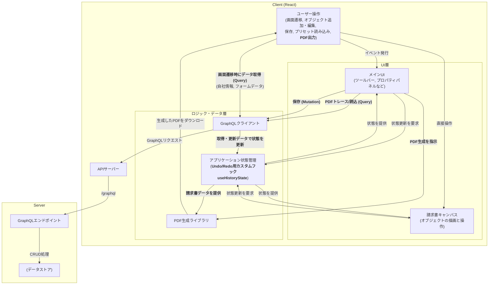

# 設計書 - 請求書エディタ (面接用)

## 1. 概要

本ドキュメントは、インタラクティブな請求書エディタアプリケーションの設計について、技術面接での議論に適した粒度で記述するものです。ユーザーが直感的な UI を通じて、テキスト、画像、テーブルなどの要素を自由に配置・編集し、カスタマイズされた請求書を作成できる Web アプリケーションを提供します。

### 1.1. 主なゴール

- ユーザーが見たままの形で請求書を編集できる、インタラクティブなキャンバスを提供すること。
- Redo・Undo やコピーペーストなどの編集状態の管理ができること。
- キャンバス上で共通のオブジェクト操作（移動、リサイズ）の仕組みを各オブジェクト（テキスト、画像、テーブルなど）に適用すること。
- 対象のオブジェクトの編集をプロパティパレットで詳細な設定ができること。
- 編集した請求書を PDF としてプレビューできること。
- 過去編集した PDF を参照し、レイアウトプリセットとして使用すること。

## 2. アーキテクチャ

このアプリケーションは、**クライアントサーバーモデル**を採用しています。

**クライアントサイド**は React と TypeScript で構築されており、ユーザーが請求書を直接編集できるインタラクティブな「キャンバス」と、各種設定を行うための「UI パネル」が主な UI です。
状態管理が中心的な役割を担っており、特に`useHistoryState`というカスタムフックを用いて、Undo/Redo（やり直し/元に戻す）機能を実現しているのが特徴です。サーバーとの通信は、GraphQL で行われます。

**サーバーサイド**は、クライアントからのリクエストに応じてデータを操作するための GraphQL API を提供します。API サーバーがリクエストを受け取り、GraphQL エンドポイントがそれを解釈して、データストア（データベース）に対するデータの保存（Mutation）や、過去の請求書データの読み込み（Query）といった処理を実行します。

この構成により、クライアントは UI とインタラクションに集中でき、サーバーはデータの永続性に責任を持つという、役割が明確に分離された設計になっています。



## 3. 主要コンポーネントの役割

アプリケーションは、責務に応じた複数の React コンポーネントで構成されています。

- **アプリケーションルート:** アプリケーション全体の状態（請求書データ、選択中のオブジェクトなど）を一元管理し、主要なコンポーネントの配置と状態の伝達を行います。
- **フォーム/ツールパネル:** 新しいレイアウトオブジェクトの追加、PDF ファイルのアップロード、請求書詳細情報の入力など、ユーザー操作の起点となる UI を提供します。
- **PDF プレビューキャンバス:** 請求書のライブプレビューを表示する中心的なコンポーネントです。オブジェクトのドラッグ＆ドロップ、リサイズ、選択、インライン編集といったインタラクティブな操作を可能にします。
- **プロパティパレット:** 選択されたオブジェクトの共通プロパティ（座標、サイズ）や、オブジェクト種別ごとの固有プロパティ（テキストのフォント、テーブルの背景色など）を編集する UI を提供します。
- **レイヤーパネル:** キャンバス上の全オブジェクトをレイヤーとして一覧表示し、スタッキング順序の変更や削除といった管理機能を提供します。

## 4. データモデル

アプリケーションのデータは、請求書全体の構造と、キャンバス上の各オブジェクトのプロパティを表現するために設計されています。

- **`InvoiceData`:** アプリケーションのルートとなるデータ構造で、請求書全体のフォームデータと、すべてのレイアウトオブジェクトの配列を含みます。
- **`LayoutItem`:** キャンバス上のすべてのオブジェクト（テキスト、画像、テーブルなど）を表すための中心的な型です。`type` プロパティによってオブジェクトの種類を判別し、それぞれが固有のプロパティを持ちます。

## 5. 状態管理と履歴機能

アプリケーションの状態は、状態の性質に応じて React のフックを使い分けて管理しています。

- **`useHistoryState` (カスタムフック):** Undo/Redo が必要な請求書データ (`invoiceData`) を管理します。
- **`useState` (React 標準フック):** 選択中のオブジェクト ID など、履歴が不要な UI 関連の単純な状態を管理します。

これにより、ロジックのカプセル化と関心の分離を図りつつ、ユーザーが安心して編集作業を行える Undo/Redo 機能を提供しています。

## 6. 主要機能の技術的アプローチ

### 6.1. インタラクティブなキャンバス

- **オブジェクト操作:** `react-rnd` ライブラリを活用し、キャンバス上のオブジェクトのドラッグ＆ドロップ、リサイズといった直感的な操作を実現しています。これにより、ユーザーはオブジェクトの角や辺をドラッグして、インタラクティブにサイズを変更できます。
- **インライン編集:** テキストやテーブルセルは、直接キャンバス上で編集可能です。
- **レイヤー管理:** 各オブジェクトの重なり順序は、`zIndex`プロパティによって制御され、専用の UI を通じて管理できます。

### 6.2. PDF 生成

アプリケーションは、目的別に異なるアプローチで PDF を生成します。

- **ライブプレビュー:** 編集中の請求書をリアルタイムで表示するために、軽量な PDF 操作ライブラリを使用し、動的に PDF のバイナリデータを生成して表示します。これにより、高速なフィードバックを提供します。
- **ダウンロード用 PDF:** 最終的な高品質な PDF ドキュメントを生成するためには、React コンポーネントの宣言的な構文で PDF を定義できるライブラリを使用します。これにより、複雑なレイアウトもコードベースで管理しやすくなっています。

## 6.3. サーバー API インターフェイス (GraphQL)

サーバー API は GraphQL で定義されます。このアプリケーションの要件である「請求書データの保存・一覧取得・個別取得」といった操作を、CRUD 形式で実現します。

```graphql
# 任意のJSONオブジェクトを表すカスタムスカラー型
scalar JSON

# 自社情報
type CompanyInfo {
  name: String!
  address: String!
  phoneNumber: String
  bankAccount: String
}

# 取得系のクエリ
type Query {
  getInvoice(id: ID!): Invoice
  getInvoices: [Invoice!]! #PDFトレース用
  getCompanyInfo: CompanyInfo #自社情報取得
}

# 請求書データを変更するための操作
type Mutation {
  updateInvoice(id: ID!, input: UpdateInvoiceInput!): Invoice!
  createInvoice(input: CreateInvoiceInput!): Invoice! #当該画面ではしようしない
  deleteInvoice(id: ID!): Boolean! #当該画面ではしようしない
}

# 請求書全体のデータ型
type Invoice {
  id: ID!
  name: String!
  layout: JSON! # キャンバス上のオブジェクト配列
  form: JSON! # 請求日や顧客名などのフォームデータ
  createdAt: String!
  updatedAt: String!
}

# 新規作成用の入力データ型
input CreateInvoiceInput {
  name: String!
  layout: JSON!
  form: JSON!
}

# 更新用の入力データ型
input UpdateInvoiceInput {
  name: String
  layout: JSON
  form: JSON
}
```
