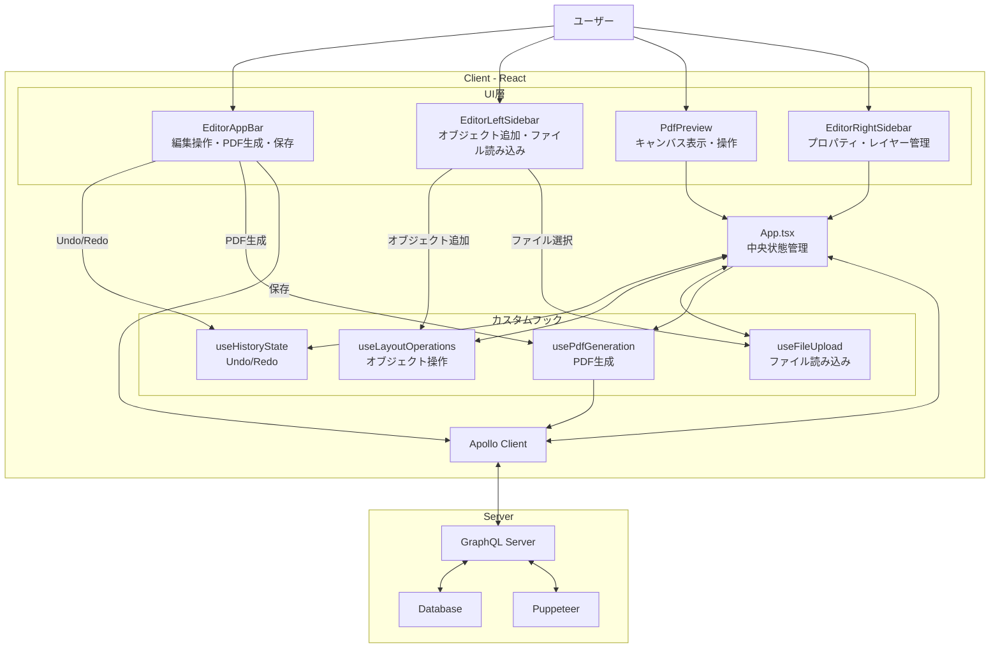

# 書類のカスタムレイアウト機能 - フロントエンド設計

## Context and scopes

本ドキュメントは、請求書発行機能における 「書類のカスタムレイアウト」 を実現するためのフロントエンド設計を記述します。
ユーザーが GUI 上で請求書レイアウトを自由にカスタマイズできる機能を対象とします。
## Goal

- ユーザーが WYSIWYG 編集できるインタラクティブなキャンバスを提供する
- Redo・Undo・コピー・ペースト・削除などの編集操作の管理を可能にする
- 各オブジェクト（テキスト・画像・テーブル・図形・箇条書き等）をキャンバスに追加できるようにする
- オブジェクトに共通の操作（ドラッグで移動・ハンドルでリサイズ）を適用する
- オブジェクトのレイヤーの順番を入れ替えられるようにする（zIndex の操作）
- 選択したオブジェクトの詳細（スタイル・位置・サイズ等）をプロパティパネルで設定できるようにする
- テキストオブジェクトを変数表示（`{{金額}}円`等）とデータ例表示（`10,000円`等）で切り替えられるようにする
- 編集した請求書を PDF としてプレビューできること
- DBに保存された既存の請求書レイアウトをプリセットとして読み込み、再利用できること（PDFトレース）
## Non Goals（Optional）

- バックエンドの詳細設計（DB スキーマ/インフラ等）は対象外。
## Architecture

### 概要

**Client: React + TypeScript**
- インタラクティブキャンバス + 設定 UI パネル
- 状態管理: useHistoryState による Undo/Redo（対象は後述）
- Undo/Redo の対象: layout: BaseLayoutItem[] のみ（form や会社情報は別画面のフォームで管理し、本画面では参照/適用のみ）
- コンポーネント設計: UI層とロジック層を明確に分離
  - UI層: EditorAppBar（トップバー）、EditorLeftSidebar（ツール）、EditorRightSidebar（プロパティ）
  - ロジック層: カスタムフック（useLayoutOperations、useFileUpload、usePdfGeneration）
    - useLayoutOperations: オブジェクトの追加・削除・コピー・ペースト・レイヤー移動
    - useFileUpload: 画像・PDFファイルの読み込み処理
    - usePdfGeneration: PDF生成・プレビュー

**Server: GraphQL API（Apollo Client 経由で利用）**
- データの取得・保存・プリセット参照

この構成により、フロントは UI/操作に集中し、サーバーはデータ永続性を担保する役割分担を実現。
### System context diagram

この機能は以下の間でのデータのやり取りを中心とします：

- ユーザー（ブラウザ操作）
- フロントエンド（React アプリ）
- バックエンドサービス（GraphQL API）
- データベース

#### アーキテクチャ図



### Service Interface（GraphQL）

```graphql
scalar JSON

# 共通スタイル定義
type Style {
  fontFamily: String
  fontSize: Float
  lineHeight: Float
  textAlign: String
  verticalAlign: String
  color: String
  bold: Boolean
  italic: Boolean
  wordWrap: Boolean
  backgroundColor: String
  textShadow: String
  isBullet: Boolean
  borderColor: String
  borderWidth: Float
  borderStyle: String
}

# テーブルセル
type TableCell {
  id: String!
  content: String!
  contentType: String
  label: String
  style: Style
}

# キャンバス上のオブジェクト（説明用に1型で統合）
type LayoutItem {
  id: String!
  type: String!          # text, image, table, shape
  x: Float!
  y: Float!
  width: Float!
  height: Float!
  zIndex: Int!
  locked: Boolean
  visible: Boolean

  # TextItem 用
  content: String
  contentType: String
  label: String

  # ImageItem 用
  src: String

  # TableItem 用
  data: [[TableCell]]

  # ShapeItem 用
  shapeType: String

  # 共通スタイル
  style: Style
}

# 請求書全体
type Invoice {
  id: ID!
  name: String!
  layout: [LayoutItem!]!  # キャンバス上のオブジェクト
  form: Form!             # フォームデータ（請求日、宛先、合計など）
  createdAt: String!
  updatedAt: String!
}

# 更新用の入力型
input UpdateInvoiceInput {
  name: String
  layout: [JSON!]         # 実装では BaseLayoutItem[] を JSON として受け取る
  form: JSON
}

# クエリ
type Query {
  getInvoice(id: ID!): Invoice
  getInvoices: [Invoice!]!   # PDFトレース用
  getCompanyInfo: JSON       # 自社情報（別画面フォームから参照）
}

# ミューテーション
type Mutation {
  updateInvoice(id: ID!, input: UpdateInvoiceInput!): Invoice!
  generatePdf(html: String!): String # Puppeteerによるサーバーサイド PDF 生成
}
```

### TypeScript 型（Client 内部）

```typescript
// PDF上のインタラクティブなオブジェクトの基底
export type BaseLayoutItem = {
  id: string; // オブジェクトの一意な識別子
  x: number; // PDF上でのX座標（左端からの距離）
  y: number; // PDF上でのY座標（上端からの距離）
  width: number; // オブジェクトの幅
  height: number; // オブジェクトの高さ
  zIndex: number; // オブジェクトの重なり順（大きいほど前面）
  locked?: boolean; // オブジェクトがロックされているか（編集不可）
  visible?: boolean; // オブジェクトが表示されているか
};

// テキストアイテムのスタイル定義
export type TextItemStyle = {
  fontFamily?: string; // フォントファミリー（例: "BIZ UDPGothic", "Noto Sans JP"）
  fontSize?: number; // フォントサイズ
  lineHeight?: number; // 行の高さ
  textAlign?: "left" | "center" | "right"; // テキストの水平方向の配置
  verticalAlign?: "top" | "center" | "bottom"; // テキストの垂直方向の配置
  color?: string; // テキストの色
  bold?: boolean; // 太字かどうか
  italic?: boolean; // 斜体かどうか
  wordWrap?: boolean; // 自動改行するかどうか
  backgroundColor?: string; // 背景色
  textShadow?: string; // テキストの影
  isBullet?: boolean; // 箇条書きかどうか
  borderColor?: string; // 枠線の色
  borderWidth?: number; // 枠線の太さ
  borderStyle?: "solid" | "dashed" | "dotted"; // 枠線のスタイル
};

// テキストオブジェクト
export type TextObject = BaseLayoutItem & {
  type: "text"; // オブジェクトのタイプ
  content: string; // 表示するテキスト内容
  contentType: "fixed" | "variable" | "labeled-variable"; // テキスト内容の種類
  // - "fixed": 固定テキスト（例: "御請求書"）
  // - "variable": 変数のみ（例: content="{{form.total.value}}" → "132000"）
  // - "labeled-variable": ラベル付き変数（例: label="合計", content="{{form.total.value}}" → "合計 132000"）
  label?: string; // labeled-variableの場合に使用するラベル
  style?: TextItemStyle; // テキストのスタイル
};

// 画像オブジェクト
export type ImageObject = BaseLayoutItem & {
  type: "image"; // オブジェクトのタイプ
  src: string; // 画像のソース (URLまたはbase64データ)
};

// テーブルオブジェクト
export type TableObject = BaseLayoutItem & {
  type: "table";
  data: TableCell[][];
  style?: {
    backgroundColor?: string;
  };
};

// テーブルセル
export type TableCell = {
  id: string; // セルの一意な識別子
  content: string; // セルの内容
  contentType: "fixed" | "variable" | "labeled-variable"; // セル内容の種類（TextObjectと同様）
  label?: string; // labeled-variableの場合に使用するラベル
  style?: TextItemStyle; // セルのテキストスタイル
};

// 図形オブジェクト
export type ShapeObject = BaseLayoutItem & {
  type: "shape"; // オブジェクトのタイプ
  shapeType: "rect" | "h-line" | "v-line"; // 図形のタイプ
  style?: {
    // 図形のスタイル
    backgroundColor?: string; // 背景色
    borderColor?: string; // 枠線の色
    borderWidth?: number; // 枠線の太さ
    borderStyle?: "solid" | "dashed" | "dotted"; // 枠線のスタイル
  };
};

// すべてのインタラクティブなオブジェクトの共用型
export type InvoiceObject =
  | TextObject
  | ImageObject
  | TableObject
  | ShapeObject;

// 請求書を構成する個々の部品（オブジェクト）の共用型
export type LayoutItem = TextObject | ImageObject | TableObject | ShapeObject;

// フォームの各項目
export type FormField = {
  label: string;
  value: string | number;
};

// 請求書全体のデータ構造
export type InvoiceData = {
  layout: LayoutItem[];
  form: {
    issue_date?: FormField;
    due_date?: FormField;
    invoice_number?: FormField;
    company_name?: FormField;
    recipient_name?: FormField;
    total?: FormField;
    notes?: FormField; // 備考
    // ...など
  };
};
```

## Technical Decisions

技術的な意思決定

### 主要技術スタック (Core Technology Stack)

**フロントエンド:**
- React + TypeScript を採用し、堅牢かつコンポーネントベースで拡張性の高い UI を構築する。

**API 通信:**
- GraphQL + Apollo Client を採用。
- 効率的なデータ取得とキャッシュ機能を提供し、型安全な API 操作が可能。

### キャンバスの実装 (Canvas Implementation)

**採用技術:** react-rnd, pdf-lib, react-pdf

**理由:**
- インタラクティブな操作: react-rnd を利用し、キャンバス上のオブジェクト（テキスト・画像・テーブル等）を直感的にドラッグ＆リサイズ可能にする。
- 静的背景の描画: pdf-lib を使い、PDF の既存ページや画像を取り込みつつ、react-pdf で背景としてレンダリング。
- 重ね合わせ: 上記の背景に対して、React の DOM 要素を絶対配置することで WYSIWYG に近い編集体験を実現。

これにより リアルタイム編集の操作性 と 背景 PDF の再現性 を両立。

### PDF 生成 (PDF Generation)

**採用技術:** Puppeteer（サーバーサイド）、@react-pdf/renderer（クライアントサイド）

**理由:**
- 最終的なダウンロード用 PDF は サーバーサイドで Puppeteer により生成。
- HTML/CSS で記述したレイアウトをそのままレンダリングし、プレビューと出力の差異をなくす (WYSIWYG 保証)。
- 標準 CSS 完全対応（Grid, Flexbox, 絶対配置, カスタムプロパティ等）。

**日本語フォント対応:**
- Google Fonts から無料で入手可能な日本語フォントを使用
- デフォルト: Noto Sans JP（高品質なゴシック体）
- 選択肢: BIZ UDPGothic（UD フォント）、Noto Serif JP（明朝体）
- フォントは型安全に選択可能（TypeScript の Union Type で制約）

**デバッグ性:** ブラウザ開発者ツールを用いた確認が可能で、スタイル崩れの原因を迅速に調査できる。

### フロントエンドアーキテクチャのリファクタリング

**UI 層とロジック層の分離:**
- App.tsx からビジネスロジックをカスタムフックに抽出（約 460 行 → 約 330 行に削減）

**カスタムフック:**
- useLayoutOperations: レイアウトアイテムの追加・削除・コピー・ペースト・レイヤー移動
- useFileUpload: 画像・PDF ファイルの読み込み処理（FileReader API を使用）
- usePdfGeneration: React-PDF と Puppeteer を使用した PDF 生成・プレビュー

**UI コンポーネント:**
- EditorAppBar: トップバー（編集操作、プレビュー、保存ボタン）
- EditorLeftSidebar: 左サイドバー（ツールバーと図形作成パレット）
- EditorRightSidebar: 右サイドバー（プロパティ、レイヤー、状態プレビュー）

**ユーティリティ関数:**
- layoutUtils.ts: z-index 計算などのヘルパー関数

### 状態管理 (State Management)

**採用技術:** カスタムフック useHistoryState

**理由:**
- 編集中のレイアウト情報（BaseLayoutItem[]）について、Undo/Redo が必要。
- useHistoryState を利用して状態のスナップショットを履歴として保持し、ユーザーが過去の状態に容易に戻れるようにする。
- これにより直感的な編集操作を保証します。
## Alternatives Considered（Optional）

検討した代替案とその理由

下記、項目について ADR に記載：

- ADR: PDF の出力方式の選定
- ADR: PDF プレビューと操作ライブラリの選定
- ADR: ドラッグ＆ドロップおよびリサイズライブラリの選定
- ADR: データバリデーションライブラリの選定

## Cross-cutting concerns（Optional）

システム全体に影響する非機能要件や共通処理

### 対応環境

**ブラウザ:**
- Chrome, Edge, Firefox の最新版
- Safari ≥ 14（Safari 13 以前は FinalizationRegistry 非対応のためサポート外）
- react-pdf の話

**モバイルブラウザ:**
- iOS Safari, Android Chrome はプレビュー中心の利用を想定
- 編集操作は PC 向けを基本とし、タッチ操作対応は優先度低

### アクセシビリティ

**キーボード操作:**
- Tab キーによるオブジェクトフォーカス移動
- 矢印キーによる位置調整（1px / 10px 単位移動)

**スクリーンリーダー:**
- キャンバス上のオブジェクトには aria-label を付与し、要素の種類や内容を伝達
- 編集可能/ロック済みなどの状態も通知

**ライブラリの特性:**
- react-rnd: 標準でキーボード/スクリーンリーダー非対応 → 独自実装が必要
- dnd-kit: アクセシビリティ API を標準サポート（フォーカス管理やセンサー制御が可能）

### エラーハンドリング

- ネットワーク障害、保存失敗、API エラーに対してはユーザーにトースト通知
- Undo/Redo と組み合わせて「直前の状態に戻す」ことを保証

### パフォーマンス

**スケルトン UI の導入:**
- レンダリング切り替え時に白画面を出さず、スケルトン UI を表示することで体感レスポンスを改善

**キャッシュ活用:**

*UI レンダリングキャッシュ:*
- React.memo によるオブジェクトコンポーネントの再描画抑制
- useMemo / useCallback による不要な計算・ハンドラ再生成の削減

*データキャッシュ:*
- Apollo Client のキャッシュを利用し、同じ請求書データや自社情報を再取得せず高速化

### テスト戦略

- 単体テスト: レイアウトアイテム（移動、リサイズ）の状態更新ロジックをテスト。
- E2E テスト: キャンバス操作と PDF 出力までの一連の流れを Cypress/Playwright などで確認。
