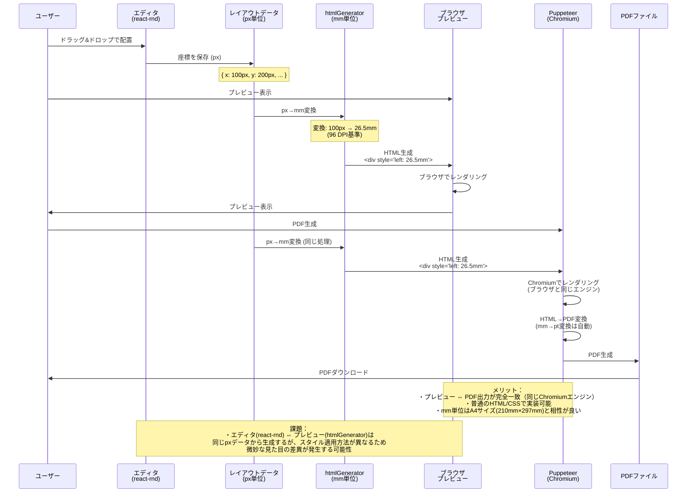
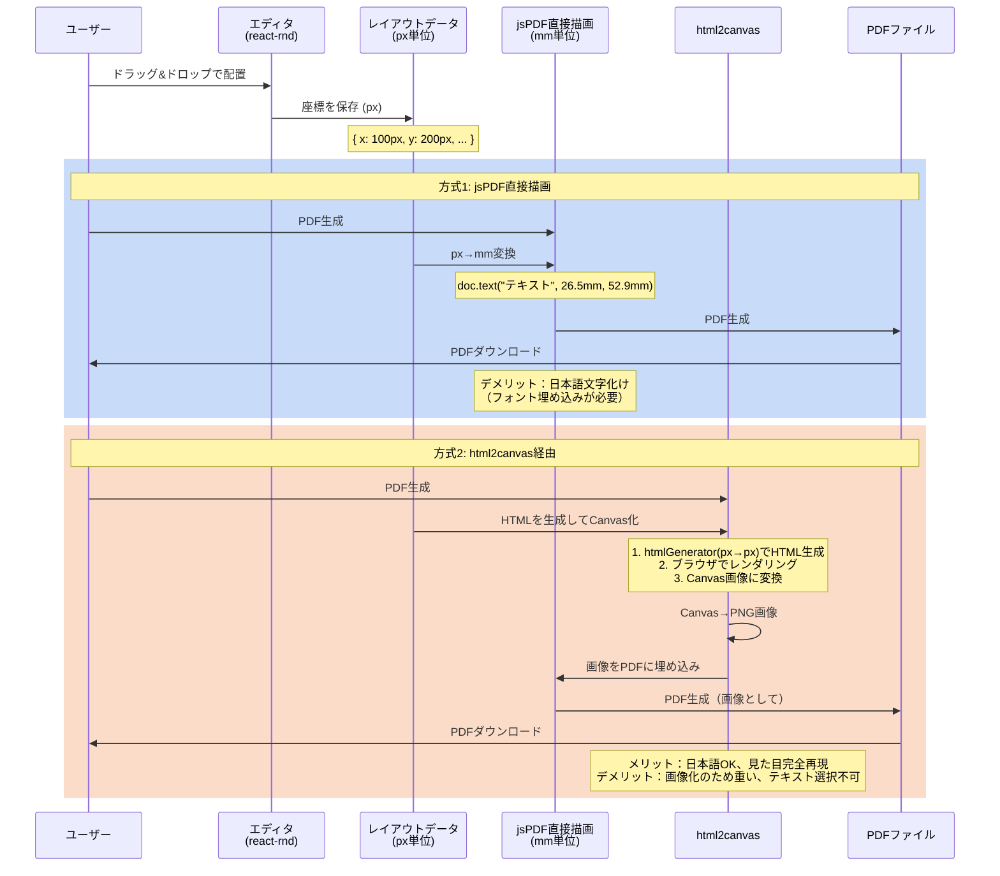

# PDF生成の座標変換フロー

## 現状（mainブランチ）: React-PDF + pdf-lib + Puppeteer

現在のmainブランチでは、**3つのライブラリが共存**しています：

1. **React-PDF (@react-pdf/renderer)**: プレビュー表示用
2. **pdf-lib**: PDF編集・インポート用
3. **Puppeteer**: サーバー側でのPDF生成

```mermaid
sequenceDiagram
    participant User as ユーザー
    participant Editor as エディタ<br/>(react-rnd)
    participant Data as レイアウトデータ<br/>(px単位)
    participant ReactPDF as React-PDF<br/>(pt単位)
    participant PdfLib as pdf-lib
    participant HtmlGen as htmlGenerator<br/>(mm単位)
    participant Puppeteer as Puppeteer<br/>(サーバー側)
    participant PDF as PDFファイル

    rect rgb(0, 0, 0)
        Note over User,ReactPDF: フロー1: React-PDFでプレビュー
        User->>Editor: ドラッグ&ドロップで配置
        Editor->>Data: 座標を保存 (px)
        User->>ReactPDF: 「プレビュー (React-PDF)」ボタン
        Data->>ReactPDF: InvoiceDocumentコンポーネント<br/>(px→pt変換必要)
        ReactPDF->>ReactPDF: <Document><View style={{left: 75pt}}>
        ReactPDF->>PDF: PDF生成 (pt単位)
        PDF->>User: プレビュー表示
    end

    rect rgb(0, 0, 0)
        Note over User,Puppeteer: フロー2: Puppeteerでサーバー生成
        User->>Puppeteer: 「プレビュー (Puppeteer)」ボタン
        Data->>HtmlGen: px→mm変換
        HtmlGen->>Puppeteer: HTML (mm単位)
        Puppeteer->>Puppeteer: Chromiumでレンダリング
        Puppeteer->>PDF: PDF生成
        PDF->>User: プレビュー表示
    end

    rect rgb(0, 0, 0)
        Note over User,PdfLib: フロー3: pdf-libでPDFインポート
        User->>PdfLib: PDFファイルをアップロード
        PdfLib->>PdfLib: PDFを解析
        PdfLib->>Data: レイアウトデータに変換<br/>(pt→px変換)
        Data->>Editor: エディタに反映
    end

    Note over Data,Puppeteer: 問題点：<br/>・3つのライブラリで3つの座標系を管理<br/>・React-PDF(pt) / Puppeteer(mm) / pdf-lib(pt)<br/>・学習コスト高、保守コスト高<br/>・約650行のコード
```

この複雑な構成を整理するために、以下の選択肢が検討されました。

---

## Option B: HTML + Puppeteer方式（PR #1で実装中）

## Option C: Canvas + jsPDF方式（experiment/verification）

## 座標単位の変換式

| 変換 | 計算式 | 備考 |
|------|--------|------|
| px → pt | `px * 72 / 96 = px * 0.75` | 96 DPI → 72 DPI |
| px → mm | `px * 25.4 / 96 = px * 0.2646` | 96 DPI基準 |
| mm → pt | `mm * 72 / 25.4 = mm * 2.834` | Puppeteerが自動変換 |

## まとめ

### 現状（mainブランチ）: React-PDF + pdf-lib + Puppeteer
- **3つのライブラリを併用**で複雑
- **課題**: 保守コストが高い、学習コストが高い、コード量が多い（約650行）

### Option B: HTML + Puppeteer方式（PR #1で実装中）
- **座標変換**: px → mm（手動変換が必要）
- **単位系**: DOM(px) → HTML(mm) → Puppeteer(自動でpt) → PDF(pt)
- **メリット**: プレビューとPDF出力が完全一致（同じレンダリングエンジン）、約650行削減
- **課題**: エディタUIとプレビューのスタイル差異、サーバー依存

### Option C: Canvas + jsPDF方式（PR #6で検証中）
- **座標変換**:
  - 直接描画: px → mm（手動変換）
  - html2canvas: px → px（変換不要、画像化するだけ）
- **メリット**: クライアント完結
- **デメリット**: 実装コスト高 or 画像化で品質低下
